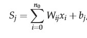

# Methodology 

## Section 1: Introduction
	
From 2000 - 2018, the Measles vaccine has saved close to 23.2 million people worldwide, but regardless of its life saving capabilities, roughly 140,000 people, maily children under 5 years-old, died due to the viral infection within 2018 alone (World Health Organization). Though 140,000 is a global number, the deaths from this virus is inequitable, as many of the deaths are within developing countries who continue to struggle with the vaccination coverage (World Health Organization).  A strong country of interest when analyzing vaccination coverage, is Nigeria because its low vaccination coverage in states (Adedire et al., 2016). Vaccination coverage is an adaptive complex system because of its numerous interrelated factors  (ie mother’s education, income, distance to healthcare facilities) and the ability to change vaccination coverage through targeted policies. Despite the profound data on Measles, Measles vaccination coverage, and Measles vaccination coverage in Nigeria, there is still a gap in the research with regards to the correlation between crime rate and vaccination coverage, leading to a question of how crime rate can predict vaccination coverage.
	
In order to further progress this field of research and address the apparent gap, this research will aim its methodology towards answering the question what is the correlation between crime rates and the Measles vaccination coverage of under 5 year-olds in the country of Nigeria. Specifically, this question is indicative of exploratory and evaluative research because it aims to understand more about social processes and how it intertwines with vaccination coverage. Likewise, the questions begins a comprehension on the causal relationship between crime rate and vaccination coverage. Furthermore for a seemingly broad question, it breaks down into three sub questions that the methodology hopes to answer:
1) What are current key factors of vaccination coverage (covered in literature review)
2) Which models are better for calculating vaccination coverage with current key factors
3) How do those outcomes correlate with crime rate
  3a) How do those outcomes change when crime rate is included within the statistical analysis.
	
Picking the correct model for vaccination coverage is an intricate, delicate, and impactful process because various factors influence vaccination coverage. Also, data on vaccination is generally not provided as a whole census, so accurately correlating variables will greatly sway the predictions of where vaccination coverage is and is not high. In order to break this process apart, the methodology will be split into the following four sections: Data Selection, Bayesian Hierarchical Model, Artificial Neural Network, and the methodological layout of this study.

## Part 2: Data Selection

Data regarding the vaccination coverage of children under 5-years old will be obtained from Demographic and Health Surveys (DHS). The DHS Program is a recent program which conducts standardized survey assessments on many developing countries, one of which is Nigeria, as noted in USAID’s DHS Spatial Analysis Report (Gething et al., 2015). For survey implementation, the DHS sends out trained surveyors to randomly selected Enumeration Areas (EA), areas determined by the countries census bureau to interview a random cluster of households within the that cluster itself, interviewing a total of 20-30 random households from a set of 200-300 households within the EA (Gething et al., 2015). From these interviews, questions regarding many demographic characteristics (i.e. education, race, income level) are asked, including vaccination coverage, and these questions (Gething et al., 2015). The latitude and longitude of the EA cluster is recorded, however for privacy reasons the cluster centroid is displaced 2-5 kilometers, depending if the area is urban or rural respectively (Utazi et al., 2018).  This study incorporates DHS data because of its detailed nature, its breadth of figures, allowing researchers to draw multiple correlations between variables, and backing behind many research in this field. 

	Data regarding crime rates of Nigeria will be obtained from publicly available data on crime incidence. Likewise, data regarding geospatial covariates of the country will be obtained from publicly available databases such the Humanitarian Data Exchange. The process of covariate selection varies based on statistical analysis, so the discussion will be disseminated within the later two sections. 

## Section 3:  Bayesian Hierarchical Model

Considering that there is no national survey asking each Nigerian household about their corresponding vaccination status, a method is needed to map out the uncertainty levels, or filling in the gaps, of the vaccination coverage for areas with no recorded vaccination statuses. A way to map out uncertainty is through the Bayesian Hierarchical Model (Bosco et al., 2017). The underlying mathematical premise that the conditional probability an event A occurring while an event B has occurred is multiplied by the probability of event A occurring, and this is divided by the probability of B occuring which sets both to equal the probability of B occuring (Brookes-Bartlett, 2018). In other terms, this model allows researchers to identify a posterior distribution of an event occurring, given our prior beliefs and evidence to make this inference. Below is an example of this mathematical concept. 

 
Figure 1. Bayesian Hierarchical Model (Brookes-Bartlett, 2018)

Applying this to the study of vaccination coverage, Utazi et al. conducted analyses of the vaccination coverage in Nigeria (2018). In this study, the researches correlated the DHS survey responses of vaccination status with different geospatial covariates and other of their own responses through Generalized Linear Models (GLM’s), acting as their prior belief and evidence for different probabilities (Utazi et al., 2018). In the sense of a spatial model, the different correlations cause for different weights of vaccination coverage given the circumstances of a given location, providing an unequal distribution of vaccination coverage (Utazi et al, 2018). Applying these correlations with the Bayesian Hierarchical Model, the researchers reached a map with Confidence Intervals reaching above 95%. A figure below illustrates this process.

 
Figure 2: Spatial Process of a Bayesian Hierarchical Model (Utazi et al., p. 1584, 2018)

   
	When deciding to conduct a Bayesian Hierarchical Model, researchers differ on the use of a Gaussian random fields or Laplace moving averages to help create the unequal distribution within the spatial regression model prior to the input into the bayesian model. In the case of Utazi et al., a Gaussian process was applied to the spatial regression model “to model spatial dependence of data” and “capture the effects of spatially-varying covariate factors” (p. 1585, 2018). However in the argument for using the Laplace moving averages instead, researches suggest that this model allows for less smoothing over sharper inequalities, allowing for even more unequal distribution (Walder & Hanks, 2019). Regardless of the decision, both allow for unequal distribution. 

## Part 4: Artificial Neural Networks

Neural Networks range in type and applications, but Artificial Neural Networks (ANN’s) are beginning to become a large part of geospatial science and prediction. In a study predicting  diarrhea infections from DHS data, researchers Abubakar and Olatunji used ANN to correlate diarrhea infections with DHS data in order to create an unequal distribution on a map, and they have a clear explanation of ANN’s in this use (2019). In general Neural Networks are composed of “ at least two physical components that include neurons and a weighted link that connects each component to its next neighbors,” and neurons can either be input, hidden, or output neurons (Abubakar & Olatunji, p. 5359, 2019). The process that takes place is that input neurons relay information to the hidden neurons which are conducting activation functions, likely from an algorithm, the hidden neuron output is passed to the output neuron to conduct an additional regression, likely something basic, which then provides the unequal weighted distribution of the covariates and its relation to a given variable (Abubakar & Olatunji, 2019). The figure below illustrates this process. 
 
 
Figure 3: Schematic view of neural network (Abubakar & Olatunji, p. 5360, 2019)
	
	In a slightly similar study, researchers studied gender-disaggregated development factors using DHS data, geospatial covariates, and ANN’s (Bosco et al., 2017). The researchers chose to study an ANN’s methodology because of its “capacity to model linear and nonlinear relationships”   (Bosco et al., p. 4, 2017). This case, the algorithim used for the activation function was as follows.

 
Figure 4: Activation function (Bosco et al., p. 4, 2017)
	In this case, “Wij is the connection weight, xi is the input to the network and bj is the bias term,” and the function is the sum of those in the equation to equal the incoming signal(Bosco et al., p. 4, 2017). In the end, Bosco et al. compared their results to using a Bayesian Hierarchical Model and found relatively similar levels of accuracy.
